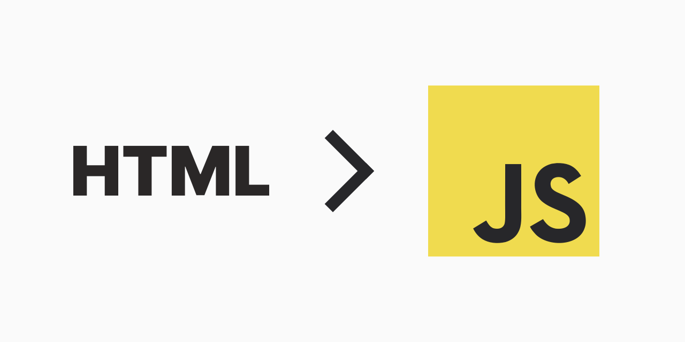

Nowadays it's unreasonably hard to build web projects. Not a long time ago it was ok to use statically served HTML with a bunch of self-written CSS and JS files. Unfortunately, time has changed and almost every website seems to have a whole bunch of technologies and services amount of which exceeds the number of website users. So let's try to build a personal website with a built-in blog the simplest way possible.

## Planing

There is a big problem with me building any type of project. I always abandon them even before the launch. The more I want the final product to have, the less chance of accomplishing even a small part of that.

So this time I've decided to keep things simple. The project is gonna have minimal features.

- Blog with markdown support
- Main page with personal information

That's it. Enough for a simple personal website. That way we are not trying to keep the service featureless but to avoid unnecessary project complications. Usually, it's hard to plan from the start what functionality a service should and should not have. That's why it's such a good strategy to keep things small and grow them on demand.

> "I often compare software development to biological processes where really it is evolution. It is not intelligent design"
>
> -- Linus Torvalds

In addition, I guess it's gonna be a good idea to make a **limitation** list that will remind the boundaries we must not break to avoid accidental complexity.

- No JavaScript

To be honest, JavaScirpt is extremely overrated. Seriously, all the fame the JS has is ridiculously considering the language itself and the ecosystem it has. JavaScript definitely has its place in the developers' world, but usually, it's better to think twice before diving into it.

On the client side, there are tools that introduce different, much more convenient ways of writing logic. The most popular are [HTMX](https://htmx.org) and [Alpine](https://alpinejs.dev) but I'm not gonna use them either. They allow avoid writing JavaScript, but nevertheless, they use it under the hood which will require a user to have JS enabled in the browser. It is not a big deal, but if we can completely drop JS, why not try? That also means that there is not gonna be almost any logic on the client side which makes things even simpler.

There are some projects that prove the efficiency of such a strategy. The one that comes to my mind is [SourceHut](https://sourcehut.org). For those who don't know, it is a git repository hosting platform built with simplicity, performance and privacy in mind. Amazing project, recommend checking it out.

## Building

To build all the logic I'm gonna use Go as it is ideal for such kinds of projects. Usually, the first decision here is which web framework/library to use. There are several decent options widely used among gophers:

- Fiber
- Echo
- Chi
- Gin

So which of them I'm gonna choose? None. I've decided to stick with the built-in `net/http` package. Why? Because it's just enough. Nothing stops us from migrating to one of the listed solutions if at some moment `net/http` will be enough. Also considering the new features added with [Go 1.22 release](https://go.dev/blog/routing-enhancements) net/http seems more attractive than ever before.

So let's begin with building the blog functionality. The first thing I'm gonna do is define the data structure for an `Article`.

```go
type Article struct {
	Title   string
	Summary string
	Date    time.Time
	Content template.HTML
}
```

The Content field has the `template.HTML` because there is no need to use raw markdown. That way we can read all available `.md` files and imideatly convert them to HTML.

Every article should have its unique ID which will used in the URL to get the article. Titles perfectly suit that purpose, as they must be unique to distinguish articles. As a nice bonus, users can quickly understand what an article is about only by looking at its URL. The only thing we should do is convert the title to a URL-friendly form. To do that we should remove leading and trailing whitespaces, replace all spaces with underscore and make all letters lowercase.

```go
func (a Article) ID() string {
	return strings.ToLower(
		strings.ReplaceAll(strings.TrimSpace(a.Title), " ", "_"),
	)
}
```

The next unavoidable thing is markdown parsing. For that, I'm gonna use [yuin/goldmark](https://github.com/yuin/goldmark) package. The plan is to walk through a directory, read all the `.md` files, extract all the metadata and convert the content to HTML.

```go
// error checking are skiped in sake of readability
func ExtractFromFS(files fs.FS) ([]Article, error) {
	md := goldmark.New(goldmark.WithExtensions(extension.GFM, meta.Meta))

	var articles []Article
	err := fs.WalkDir(files, ".", func(path string, d fs.DirEntry, err error) error {
		if d.IsDir() || filepath.Ext(path) != ".md" {
			return nil
		}

		articleRaw, err := fs.ReadFile(files, path)
		article, err := markdownToArticle(md, &articleRaw)
		articles = append(articles, article)

		return nil
	})

	return articles, err
}
```

The logic is done, the only thing left is to serve all the data in a format suitable for users. To achieve this all we have to do is to apply several templates and serve the result together with all static data required. There are gonna be two templates, one for the home page and the other for the article page.

```html
<!-- Home page -->
<body>
	<div>
		<h1>Author</h1>
		<p>About</p>
	</div>
	<h1>Blog</h1>
	{{range .}}
	<div>
		<a href="./blog/{{.ID}}/"><h2>{{.Title}}</h2></a>
		<p>{{.Date.Format "January 1, 2006"}}</p>
	</div>
	{{end}}
</body>
```

```html
<!-- Article page -->
<body>
	<a href="/">Back</a>
	<h1>{{.Title}}</h1>
	<p>{{.Date.Format "January 1, 2006"}}</p>
	<p>{{.Content}}</p>
</body>
```

The website is ready. We've got really minimalistic and simple project but that is the best part of it. Simple projects are much easier to build and ship which allows quick feedback receiving. Therefore such a strategy allows us to get a much clearer vector where should development move and a wider picture of the idea that stands behind the project.

The article has not been planned as a tutorial but rather a share of the idea. That is why I have not added too much code, and the one I added has been modified to show the point in a much more compact way. If you are interested in exploring the full code or even contributing to it, you are welcome on its GitHub page [axseem/website](https://github.com/axseem/website).
